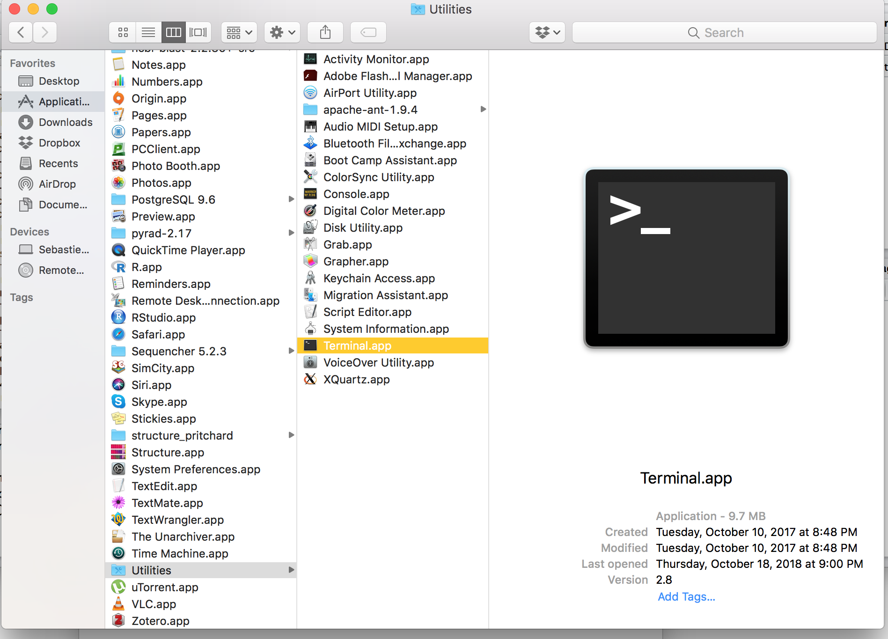

```{r setup, include=FALSE}
knitr::opts_chunk$set(echo = TRUE)
```

#Get started
• Open terminal  
&nbsp;   
{width=500px}  
&nbsp;   
• Download github repo (`curl -L https://github.com/seb951/basic_unix/archive/master.zip >master.zip`)  
• Decompress (`unzip master.zip`)  

#General principles    
• All commands are short, perform simple tasks & are highly optimized (fast)  
• Nearly all commands and options (~99%) work across Unix-based OS  
• Commands can take (many) options  
• Commands can be combined (see more later)  
• Many commands don't require any argument, some do  
• `command -option1 -option2 -optionN... parameter object`  
• Many commands output directly to terminal  
  
#Exploration
Command | Meaning
------------- | ----------------------------------------------------
`ls` | what's there
`ls -1` | with an option 
`ls -t -h` | with more options  
`ls -thor` | combining even more options
`man ls` | how to run command (q = quit; d = next page; ; arrows & fn arrows = scrolling)  
`pwd`| where are we (full path)  
`cd` | move somewhere else (default to home)   
`cd ..` | move back  
`cd ../Applications` | move back, then forward  
`cd ~ ` | move home 
`cd /` | move to root    

#Moving / removing / creating files
Command | Meaning
------------- | ----------------------------------------------------
`mv` | move  
`cp` | copy  
`rm` | **careful** remove a file 
`rmdir` | **careful** remove an empty directory  
`rm -r` | **VERY careful** remove directory recursively
`mkdir` | create empty directory 
`touch` | create empty file  
`echo` | print message to screen 

#Examining files
Command | Meaning
------------- | ----------------------------------------------------
`head` | print first 10 lines to screen  
`tail` | print last 10 lines to screen    
`less` | print file line by line (use arrows + fn arrows to move up/down)
`cat` | print file content to screen 
`sort` | sort a file
`uniq` | unique lines in a file  
`clear` | clear terminal
`wc` | wordcount  
`du` | disk usage  

#Tricks
Command | Meaning
------------- | ----------------------------------------------------
`>` | redirect
`>>` | append to file
`|` | pipe   
`*` | anything (special character: for literal `*`, use `\*`)  
`?` | any character (special character)  
`Ctrl+A` | go to beginning of line in terminal    
`Ctrl+E` | end of line    
`tab key`| autocomplete

#Working remotely
Command | Meaning
------------- | ----------------------------------------------------
`ssh` | secure shell (remote connection)  
`scp`  | secure copy (remote connection)  

#Other useful commands
Command | Meaning
------------- | ----------------------------------------------------
`chmod` | change mode of file
`sudo` | superuser do  
`top` | what's running 
`kill` | kill a process   
`curl` | get stuff from web (MACOS native) or `wget` (MACOS non-native)  
`history` | see recent history     
`open` | open a file   
`ln` | symbolic link  
`which` | where is a command
`alias` | create own commands 
`nano` | edit text (whole file loaded in memory)      
`nano +123` | specify location in file  

#Profile
• Let's look at .bash_profile to modify options (e.g. `nano ~/.bash_profile`)  
• Usefull options are here: `examples/bash_example_commands`

#Compression
Command | Meaning
------------- | ----------------------------------------------------
`gzip`  | compression/decompression of files  
`gzip -cd file.gz`  | decompress to standard out (use a `>` redirect) 
`gunzip`  | compression/decompression of files  
`tar`  | compression/decompression of archives  
`tar -xvzf file tar.gz` | decompress a tar.gz (tarball)  

#Regular expressions
Command | Meaning
------------- | ----------------------------------------------------
`grep` | regular expression  
`grep -options 'pattern' file`  | regular expression   

#Examples
##Combining commands:   
• Let's look at the file `examples/sequence.fasta`  
• print line 17 by piping `head` and `tail`  
• Count lines starting with '>' (pipe `grep` and `wc`)   
• Count unique lines starting with '>' (pipe `grep`, `sort`, `uniq` and `wc`)   
• How many files is there in the directory (pipe `ls` & `wc`)  

##Install and run command line programs
• Let's look at this example:   https://github.com/rec3141/rec-genome-tools/blob/master/bin/fastagrep.pl  
• Notice the `!#` (shebang) on the first line  
• It is a short `perl` script that *greps* sequences in a *.fasta* formatted file    
• Copy-paste the text in a new file (e.g. `touch fastagrep.pl`,`nano fastagrep.pl`, paste and save)   
• Make it executable (`chmod +x fastagrep.pl`)    
• Let's look at it (`./fastagrep.pl`)  
• Let's try it (`./fastagrep.pl 'deserticola' examples/sequence.fasta`)  
• Let's symbolic link it so the computer knows where to find it (` ln source target`)  
  
##bash
• The terminal runs (by default) the `bash` command language  
• We can write or use more complex executable `bash` code  
• Let's look at an example `less examples/bash_cmd2`

&nbsp;   
&nbsp;   
&nbsp;   

